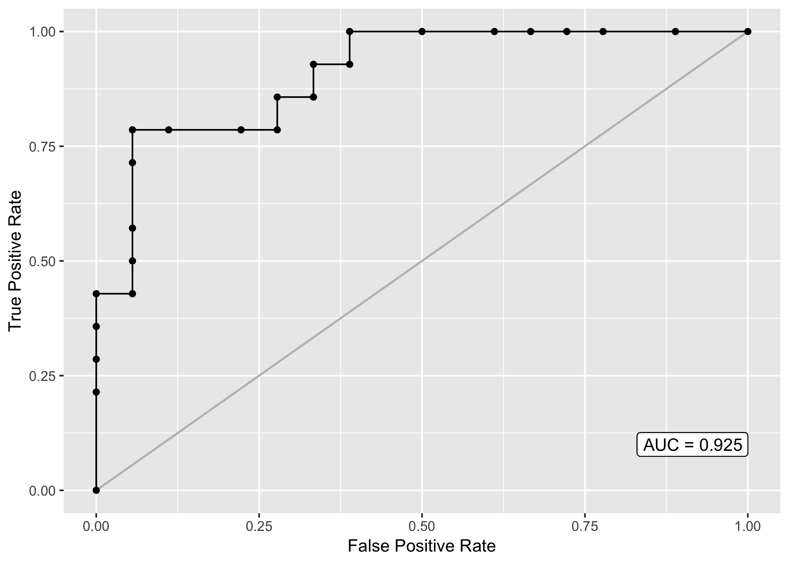

<!-- README.md is generated from README.Rmd. Please edit that file -->

# Post estimation for GLMs in R

[](https://travis-ci.org/josherrickson/postr)

[](https://codecov.io/github/josherrickson/postr?branch=master)

After fitting a logistic model in R using `glm`, getting classification
rates, ROC curves and AUCs are non-trivial - they’re easy to do, but
require coding manually every time.

The `postr` package simplifies this.

``` r
data(mtcars)
m <- glm(vs ~ gear + mpg, data = mtcars, family = binomial)
```

All functions are prefaced by `postr_` (aliased with `pr_`) to simplify
the names without worrying about conflicts with other packages. For
example,

``` r
postr_classificationtable(m, threshold = .4)
#>         Classified
#> Observed  0  1
#>        0 13  5
#>        1  3 11
pr_sensitivity(m, threshold = .4)
#> [1] 0.7857143
pr_AUC(m)
#> [1] 0.9246032
```

``` r
pr_ROC(m)
```


